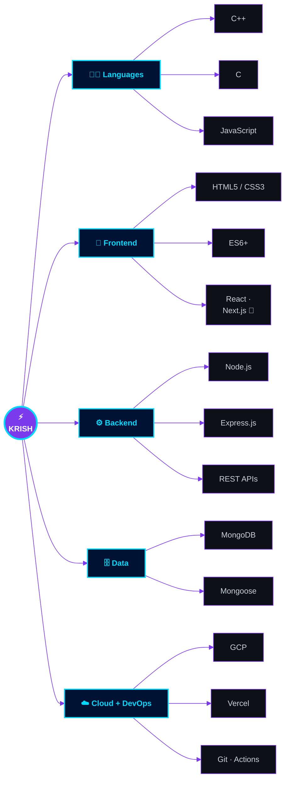
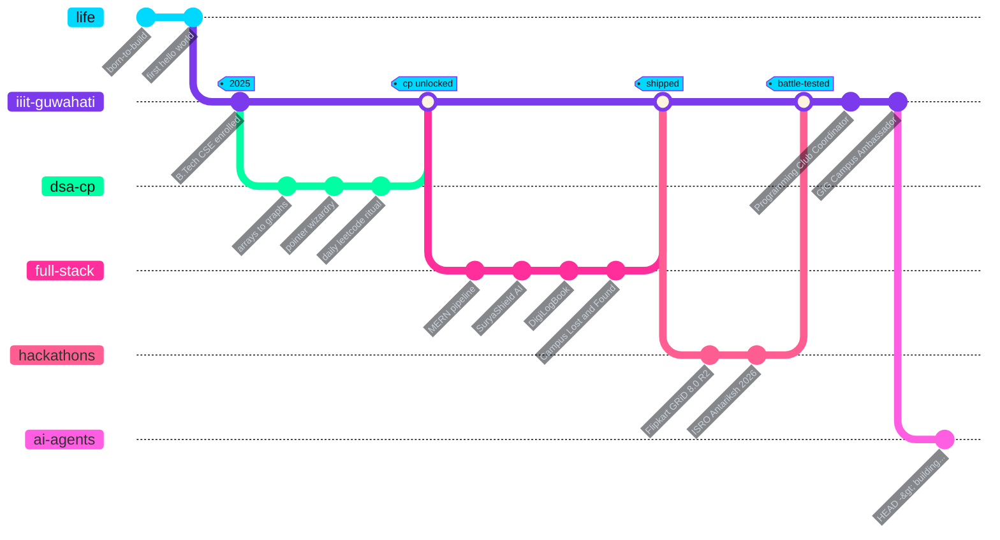
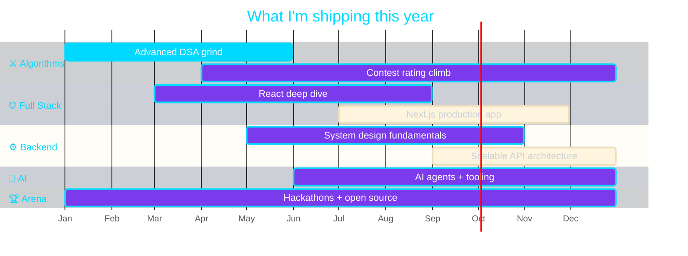
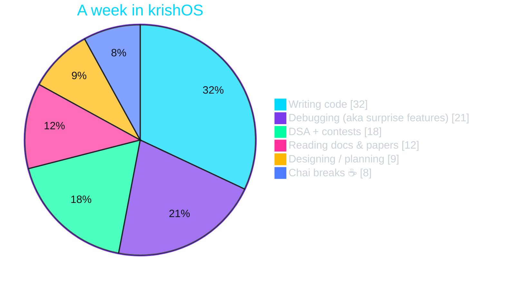

<!-- ══════════════════════════════════════════════════════════════════════════
      ⚡  K R I S H O S  ·  GITHUB PROFILE README  v2.0
      Theme    : Carbon Black · Neon Cyan (#00D9FF) · Electric Violet (#7C3AED)
      Concept  : Terminal boot sequence + native Mermaid diagrams
      Author   : github.com/codebykrixh
      Motto    : Ship. Learn. Repeat.
     ══════════════════════════════════════════════════════════════════════════ -->

<!-- ══════════════════════ 01 · HERO ══════════════════════ -->

<div align="center">
  
</div>

<div align="center">

```
        ██╗  ██╗  ██████╗   ██╗  ███████╗  ██╗  ██╗
        ██║ ██╔╝  ██╔══██╗  ██║  ██╔════╝  ██║  ██║
        █████╔╝   ██████╔╝  ██║  ███████╗  ███████║
        ██╔═██╗   ██╔══██╗  ██║  ╚════██║  ██╔══██║
        ██║  ██╗  ██║  ██║  ██║  ███████║  ██║  ██║
        ╚═╝  ╚═╝  ╚═╝  ╚═╝  ╚═╝  ╚══════╝  ╚═╝  ╚═╝
```

</div>

<div align="center">
  <a href="https://github.com/codebykrixh">
    
  </a>
</div>

<br/>

<!-- ══════════════════════ 02 · LIVE COUNTERS ══════════════════════ -->

<div align="center">
  
  &nbsp;
  <a href="https://github.com/codebykrixh?tab=followers">
    
  </a>
  &nbsp;
  <a href="https://github.com/codebykrixh?tab=repositories">
    
  </a>
</div>

<br/>

<!-- ══════════════════════ 03 · COMMAND MENU (nav) ══════════════════════ -->

<div align="center">
  <b><code>&gt; select a module to jump to</code></b>
</div>

<br/>

<div align="center">
  <a href="#-boot-sequence"></a>
  <a href="#-whoami"></a>
  <a href="#%EF%B8%8F-tech-arsenal"></a>
  <a href="#-featured-builds"></a>
  <a href="#-git-log---graph"></a>
  <a href="#-telemetry"></a>
  <a href="#-open-a-socket"></a>
</div>

<br/>

<div align="center">
  
</div>

<!-- ══════════════════════ 04 · BOOT SEQUENCE ══════════════════════ -->

<h2 align="center">🖥️ Boot Sequence</h2>

```console
root@github:~$ sudo systemctl start krish.service --verbose

[  OK  ] Mounted   /dev/curiosity                          ......... 100%
[  OK  ] Loaded    module cpp_stl.ko  (vectors, maps, sets) ......... 100%
[  OK  ] Started   competitive-programming.daemon           ......... 100%
[  OK  ] Reached   target  Full-Stack-Development.target    ......... 100%
[  OK  ] Listening on  express.socket    :3000
[  OK  ] Connected to  mongodb://atlas/ideas
[  OK  ] Spawned   ai-agents.worker  (experimental branch)
[ WARN ] Service   sleep-schedule.timer  not found — falling back to chai ☕
[ INFO ] Peak throughput detected between 00:00 and 04:00 IST
[  OK  ] krishOS is ready.  Type `./whoami` to continue.
```

<br/>

<!-- ══════════════════════ 05 · WHOAMI (neofetch) ══════════════════════ -->

<h2 align="center">👨‍💻 whoami</h2>

```console
krish@iiit-guwahati:~$ neofetch --ascii_distro krishOS

          ▄▄▄▄▄▄▄▄▄▄▄          ┌──────────────────────────────────────────────┐
       ▄█████████████▄         │  krish  ·  codebykrixh                       │
     ▄███▀▀       ▀▀███▄       ├──────────────────────────────────────────────┤
    ███▀   ▄█████▄   ▀███      │  OS ............. krishOS 2029 (rolling)     │
   ███    ███████████   ███    │  Host ........... IIIT Guwahati · B.Tech CSE │
   ██▌   ████  ▀  ████   ▐██   │  Kernel ......... C++ 23.0-competitive       │
   ███    ███████████    ███   │  Uptime ......... 1 yr · 0 unhandled crashes │
    ███▄   ▀█████▀    ▄███     │  Shell .......... bash · zsh · vim-motions   │
     ▀███▄▄       ▄▄███▀       │  Editor ......... VS Code (Dark+ forever)    │
       ▀█████████████▀         │  CPU ............ Curiosity @ 4.7GHz [OC]    │
          ▀▀▀▀▀▀▀▀▀▀▀          │  Memory ......... 87% chai · 13% lo-fi       │
                               │  Disk ........... n repos · ∞ side quests    │
   ████ ████ ████ ████         │  Locale ......... Assam, India 🇮🇳            │
   ████ ████ ████ ████         │  Theme .......... Neon Blue [Glassmorphic]   │
                               └──────────────────────────────────────────────┘
```


**Hey — I'm Krish.** I turn chai, curiosity and 2 AM energy into products people actually use.

- 🎓 &nbsp;**B.Tech CSE** — IIIT Guwahati · Class of **2029**
- ⚔️ &nbsp;**Competitive Programmer** — C++ is my weapon of choice
- 🌐 &nbsp;**Full Stack Developer** — from pixels to indexes
- 🤖 &nbsp;Building **AI-powered applications** & agentic workflows
- 🧠 &nbsp;Obsessed with **Backend Engineering** and clean architecture
- 🌱 &nbsp;**Open Source** believer · ⚡ **Hackathon** regular
- 🎯 &nbsp;**Mission:** become an exceptional Software Engineer by shipping impactful products and giving back to the community

```yaml
# ~/.config/krish/profile.yml
identity:
  name:      Krish
  handle:    "@codebykrixh"
  education: "B.Tech CSE — IIIT Guwahati (2025 → 2029)"
  location:  "Assam, India"
runtime:
  weapons:   [ "C++", "Node.js", "Express", "MongoDB", "AI" ]
  fuel:      [ "chai ☕", "lo-fi 🎧", "one LeetCode problem 🧩" ]
  peak_hrs:  "00:00 – 04:00 IST"
philosophy:
  motto:     "Ship. Learn. Repeat."
  rule_01:   "If it isn't deployed, it doesn't exist."
```

<br clear="right"/>

<div align="center">
  
</div>

<!-- ══════════════════════ 06 · TECH ARSENAL ══════════════════════ -->

<h2 align="center">🛠️ Tech Arsenal</h2>

<div align="center"><em><code>$ tree ~/skills --neon</code></em></div>

<br/>



<br/>

<div align="center">
  <a href="https://github.com/codebykrixh">
    
  </a>
</div>

<br/>

<details>
<summary><b>📦 &nbsp;expand full dependency tree &nbsp;<code>[click]</code></b></summary>

<br/>

<div align="center">

**👨‍💻 Languages**


**🎨 Frontend**


**⚙️ Backend & Data**


**☁️ Cloud · DevOps · Tools**


</div>

</details>

<br/>

<!-- ══════════════════════ 07 · SKILL METER ══════════════════════ -->

<h3 align="center">📶 Skill Confidence Meter</h3>

<div align="center"><em>self-calibrated · recompiled every semester 🔄</em></div>

<br/>

```console
krish@iiit-guwahati:~$ ./benchmark --all --verbose

  C++  &  DSA         ▰▰▰▰▰▰▰▰▰▰▰▰▰▰▰▰▰▱▱▱   85%   ⚔️  primary weapon
  Problem Solving     ▰▰▰▰▰▰▰▰▰▰▰▰▰▰▰▰▰▰▱▱   88%   🧩  daily ritual
  HTML  /  CSS        ▰▰▰▰▰▰▰▰▰▰▰▰▰▰▰▰▰▱▱▱   85%   🎨  pixel control
  Git   &  GitHub     ▰▰▰▰▰▰▰▰▰▰▰▰▰▰▰▰▱▱▱▱   78%   🌿  branch discipline
  JavaScript          ▰▰▰▰▰▰▰▰▰▰▰▰▰▰▰▱▱▱▱▱   75%   ⚡  the glue
  Node.js             ▰▰▰▰▰▰▰▰▰▰▰▰▰▰▱▱▱▱▱▱   70%   🔧  server-side brain
  Express.js          ▰▰▰▰▰▰▰▰▰▰▰▰▰▰▱▱▱▱▱▱   70%   🛣️  routes & middleware
  MongoDB             ▰▰▰▰▰▰▰▰▰▰▰▰▰▱▱▱▱▱▱▱   65%   🗄️  schemas & aggregation
  Cloud  (GCP)        ▰▰▰▰▰▰▰▰▰▰▰▱▱▱▱▱▱▱▱▱   55%   ☁️  levelling up
  Learning Appetite   ▰▰▰▰▰▰▰▰▰▰▰▰▰▰▰▰▰▰▰▰  100%   🚀  never capped

  → benchmark complete · 10 modules profiled · 0 regressions
```

<br/>

<!-- ══════════════════════ 08 · CURRENTLY LEARNING ══════════════════════ -->

<h3 align="center">🌱 Currently Compiling</h3>

<div align="center">


<br/>


</div>

<br/>

<div align="center">
  
</div>

<!-- ══════════════════════ 09 · FEATURED BUILDS ══════════════════════ -->

<h2 align="center">🚀 Featured Builds</h2>

<div align="center"><em><code>$ ls -la ~/projects --sort=impact</code></em></div>

<br/>

<div align="center">

<table>
  <tr>
    <td width="50%" valign="top">
      <div align="center">
        <h3>🛰️ SuryaShield AI</h3>
        <a href="https://github.com/codebykrixh/Suryashield-ai">
          
        </a>
        <p><em>AI-powered environmental monitoring platform<br/>that turns raw signals into readable insight.</em></p>
        <p>
          
          
          
          
        </p>
        <p>
          <a href="https://github.com/codebykrixh/Suryashield-ai"></a>
          <a href="https://suryashieldai.vercel.app/"></a>
        </p>
      </div>
    </td>
    <td width="50%" valign="top">
      <div align="center">
        <h3>📒 DigiLogBook</h3>
        <a href="https://github.com/codebykrixh/Digital-Logbook-System">
          
        </a>
        <p><em>Full-stack digital logbook for activity tracking,<br/>documentation and audit-friendly records.</em></p>
        <p>
          
          
          
          
        </p>
        <p>
          <a href="https://github.com/codebykrixh/Digital-Logbook-System"></a>
          <a href="https://digital-logbook-system.vercel.app/"></a>
        </p>
      </div>
    </td>
  </tr>
</table>

</div>

<details>
<summary align="center"><b>🎒 &nbsp;more builds in the vault &nbsp;<code>[click to decrypt]</code></b></summary>

<br/>

<div align="center">

<table>
  <tr>
    <td width="100%">
      <div align="center">
        <h3>🎒 Campus Lost &amp; Found</h3>
        <p><em>Campus item-management platform — report, track and recover lost items with a clean MERN workflow.</em></p>
        <p>
          
          
          
          
          
          
        </p>
      </div>
    </td>
  </tr>
</table>

</div>

</details>

<br/>

<div align="center">
  <a href="https://github.com/codebykrixh?tab=repositories">
    
  </a>
</div>

<br/>

<div align="center">
  
</div>

<!-- ══════════════════════ 10 · GIT LOG --GRAPH (journey) ══════════════════════ -->

<h2 align="center">🌳 git log --graph</h2>

<div align="center"><em>the commit history of a developer, rendered natively 🧬</em></div>

<br/>



<br/>

<div align="center">

| `sha` | `date` | `commit message` |
| :---: | :---: | :--- |
| `a1c9f0d` | **2025** | 🎓 &nbsp;`init` — began B.Tech CSE at IIIT Guwahati |
| `b7e42aa` | **2025** | ⚔️ &nbsp;`feat` — went deep into C++, DSA & competitive programming |
| `c3d81fe` | **2025–26** | 🚀 &nbsp;`ship` — SuryaShield AI · DigiLogBook · Campus Lost & Found |
| `d9a07bc` | **2026** | 🏅 &nbsp;`win` — Flipkart GRiD 8.0, cleared Round 1 → competed Round 2 |
| `e5f6321` | **2026** | 🛰️ &nbsp;`build` — ISRO Bharatiya Antariksh Hackathon |
| `HEAD` | **Now** | ⚡ &nbsp;`wip` — Programming Club Coordinator · GfG Campus Ambassador · AI Agents |
| `?` | **2029** | 🎯 &nbsp;`release` — graduation `▓▓▓░░░░░░░ compiling…` |

</div>

<br/>

<div align="center">
  
</div>

<!-- ══════════════════════ 11 · ROADMAP ══════════════════════ -->

<h2 align="center">🗺️ Roadmap · <code>v2026</code></h2>



<br/>

<div align="center">
  
</div>

<!-- ══════════════════════ 12 · TELEMETRY ══════════════════════ -->

<h2 align="center">📡 Telemetry</h2>

<div align="center"><em><code>$ htop --user codebykrixh</code></em></div>

<br/>

<div align="center">
  
  
</div>

<br/>

<div align="center">
  
  
</div>

<br/>

<h3 align="center">⏱️ Where the hours actually go</h3>



<br/>

<h3 align="center">📈 Contribution Activity</h3>

<div align="center">
  
</div>

<br/>

<h3 align="center">🏆 Trophy Cabinet</h3>

<div align="center">
  
</div>

<br/>

<h3 align="center">🐍 The Contribution Snake</h3>

<div align="center">
  <picture>
    <source media="(prefers-color-scheme: dark)" srcset="https://raw.githubusercontent.com/codebykrixh/codebykrixh/output/github-contribution-grid-snake-dark.svg"/>
    <source media="(prefers-color-scheme: light)" srcset="https://raw.githubusercontent.com/codebykrixh/codebykrixh/output/github-contribution-grid-snake.svg"/>
    
  </picture>
</div>

<!-- ══════════════════════════════════════════════════════════════════════
     🐍 SNAKE SETUP · one-time, ~2 minutes
     1. In THIS repo (codebykrixh/codebykrixh) create:  .github/workflows/snake.yml
     2. Paste the workflow below → commit → run it once from the "Actions" tab.
        After that it auto-refreshes every 12 hours.

     name: Generate Snake
     on:
       schedule:
         - cron: "0 */12 * * *"
       workflow_dispatch:
       push:
         branches: [ main ]
     permissions:
       contents: write
     jobs:
       generate:
         runs-on: ubuntu-latest
         steps:
           - uses: Platane/snk/svg-only@v3
             with:
               github_user_name: codebykrixh
               outputs: |
                 dist/github-contribution-grid-snake.svg
                 dist/github-contribution-grid-snake-dark.svg?palette=github-dark
           - uses: crazy-max/ghaction-github-pages@v4
             with:
               target_branch: output
               build_dir: dist
             env:
               GITHUB_TOKEN: ${{ secrets.GITHUB_TOKEN }}
     ══════════════════════════════════════════════════════════════════════ -->

<br/>

<div align="center">
  
</div>

<!-- ══════════════════════ 13 · ACHIEVEMENTS ══════════════════════ -->

<h2 align="center">🎖️ Achievements &amp; Hackathons</h2>

<div align="center">

<table>
  <tr>
    <td width="50%" valign="top">
      <div align="center"><h4>⚔️ &nbsp;Hackathon Arena</h4></div>
      <ul>
        <li>🏅 &nbsp;<b>Flipkart GRiD 8.0</b> — cleared Round 1, competed in Round 2</li>
        <li>🛰️ &nbsp;<b>ISRO Bharatiya Antariksh Hackathon 2026</b> — participant</li>
        <li>⚡ &nbsp;<b>Multiple college hackathons</b> — always shipping under pressure</li>
      </ul>
    </td>
    <td width="50%" valign="top">
      <div align="center"><h4>👑 &nbsp;Leadership &amp; Community</h4></div>
      <ul>
        <li>🧭 &nbsp;<b>Programming Club Coordinator</b> — IIIT Guwahati</li>
        <li>🌱 &nbsp;<b>GeeksforGeeks Campus Ambassador</b> — campus ↔ community bridge</li>
        <li>💙 &nbsp;<b>Open Source enthusiast</b> — learning &amp; contributing in public</li>
      </ul>
    </td>
  </tr>
</table>

</div>

<br/>

<div align="center">
  
</div>

<!-- ══════════════════════ 14 · EASTER EGGS ══════════════════════ -->

<h2 align="center">🥚 <code>cat /dev/random</code></h2>

<details>
<summary align="center"><b>🔓 &nbsp;run the easter egg &nbsp;<code>[y/N]</code></b></summary>

<br/>

```console
krish@iiit-guwahati:~$ cat fun_facts.log

  [01]  🗡️   C++ is my love language — fluent in pointers, dreams in O(log n)
  [02]  🌙   Peak productivity hits after midnight. Bugs fear the night shift.
  [03]  🧩   My idea of relaxing is a LeetCode problem and a cup of chai
  [04]  🛰️   I once hacked for space — ISRO hackathon energy is unmatched
  [05]  🐛   I don't write bugs, I write surprise features
  [06]  ⌨️   Ctrl+C / Ctrl+V are load-bearing keys on my keyboard
  [07]  🎧   Every deploy has a lo-fi track attached to it in my memory
  [08]  ♾️   Semicolons: I use them. This is a hill I will die on.

  → 8 records read · 0 regrets
```

<br/>

<div align="center">
  
</div>

<br/>

<div align="center">
  
</div>

</details>

<br/>

<!-- ══════════════════════ 15 · CONNECT ══════════════════════ -->

<h2 align="center">🔌 Open a Socket</h2>

<div align="center">
  <em>Open to collaborations, hackathon squads, open-source adventures &amp; good conversations.</em>
</div>

<br/>

```console
krish@iiit-guwahati:~$ ping krish --interactive

  → 64 bytes from krish: icmp_seq=1  ttl=64  time=0.42ms
  → status: ONLINE · accepting connection requests
```

<br/>

<div align="center">
  <a href="https://www.linkedin.com/in/krish-tayal-915b33310">
    
  </a>
  <a href="mailto:krishtayal29b@gmail.com">
    
  </a>
  <a href="https://suryashieldai.vercel.app/">
    
  </a>
  <br/>
  <a href="https://leetcode.com/u/krishtayal29b/">
    
  </a>
  <a href="https://www.instagram.com/realkrixh.exe/">
    
  </a>
  <a href="https://drive.google.com/file/d/1Sin9wSLoACBtcat3WRla8WNMHpH-FB9B/view?usp=drivesdk">
    
  </a>
</div>

<br/>

<div align="center">
  📬 &nbsp;<b>krishtayal29b@gmail.com</b> &nbsp;·&nbsp; 📍 &nbsp;<b>Assam, India</b> &nbsp;·&nbsp; 🕐 &nbsp;<b>IST (UTC +5:30)</b>
</div>

<br/>

<!-- ══════════════════════ 16 · SUPPORT ══════════════════════ -->

<h2 align="center">💙 Fuel the Next Build</h2>

<div align="center">
  <em>If a project helped you or made you smile, here's how you can power the next one:</em>
</div>

<br/>

<div align="center">
  <a href="https://github.com/codebykrixh?tab=repositories">
    
  </a>
  <a href="https://github.com/codebykrixh">
    
  </a>
  <!-- ☕ update with your own Buy Me a Coffee username -->
  <a href="https://www.buymeacoffee.com/codebykrixh">
    
  </a>
</div>

<br/>

<!-- ══════════════════════ 17 · SHUTDOWN / FOOTER ══════════════════════ -->

<div align="center">
  
</div>

<br/>

```console
krish@iiit-guwahati:~$ exit

  → session closed · thanks for scrolling
  → uptime: still building  ·  next commit: soon
  → "Ship. Learn. Repeat."
```

<br/>

<div align="center">
  <a href="https://github.com/codebykrixh">
    
  </a>
</div>

<div align="center">
  
</div>

<div align="center">
  <sub>💙 Crafted with passion by <a href="https://github.com/codebykrixh"><b>Krish</b></a> · Powered by chai ☕ &amp; lo-fi 🎧</sub>
  <br/>
  <sub>⭐ From <a href="https://github.com/codebykrixh"><b>codebykrixh</b></a> — if you like what you see, a star makes my day!</sub>
</div>

<div align="center">
  
</div>

<!-- ══════════════════════════ END OF FILE ══════════════════════════
      "Ship. Learn. Repeat."  —  Krish  ·  krishOS v2.0
     ═══════════════════════════════════════════════════════════════ -->
